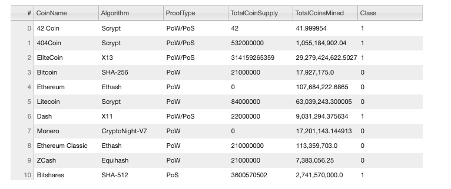
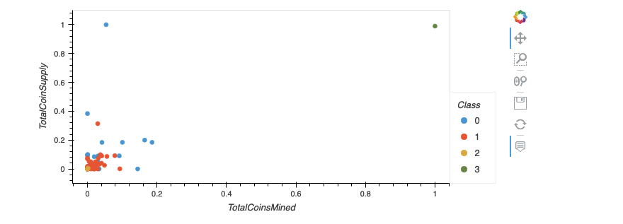

# Cryptocurrencies

The purpose of this project is to create a report that includes what cryptocurrencies are on the trading market and how they could be grouped to create a classification system for this new investment in cryptocurrencies. Data needs to be processed to fit the machine learning models. I have used unsupervised learning, clustering algorithm and data visualizations to share findings.

## Results

### Elbow Curve

From the elbow curve above, we decided that the optimal number of clusters is 4 (k=4)

### 3D Plot

### Table with tradable cryptocurrencies

The table was made using hvplot.table() function and it shows all the tradeable cryptocurrencies.

### Scatter Plot

